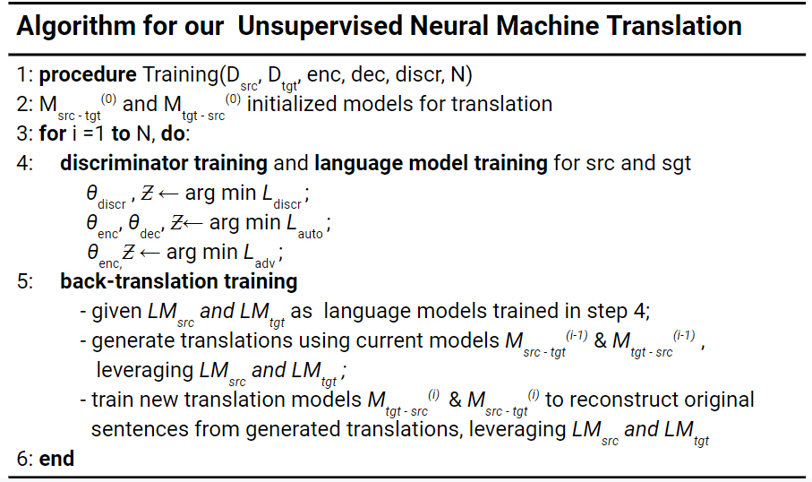

# Unsupervised Neural Machine Translation from West African Pidgin (Creole) to English 

This repository contains the implementation of an Unsupervised NMT model from West African Pidgin (Creole) to English without using a single parallel sentence during training. 

Link to paper - [https://arxiv.org/abs/1912.03444](https://arxiv.org/abs/1912.03444) (Accepted at NeurIPS 2019 Workshop on Machine Learning for the Developing World)

Key results: 

1. The alignment of Pidgin word vectors with English word vectors which achieves a Nearest Neighbor accuracy of **0.1282**. Significantly better than a baseline of **0.0093** which is the probability of selecting the right nearest neighbor from the evaluation set of 108 pairs. This aligned vector will be helpful in the performance of various downstream tasks and transfer of models from English to Pidgin. 

2. The creation of an Unsupervised Neural Machine Translation model between Pidgin and English which achieves a BLEU score of **7.93** from Pidgin to English and **5.18** from English to Pidgin on a test set of 2101 sentence pairs. Test set was obtained from the JW300 dataset [4] and preprocessed by the [Masakhane](https://www.masakhane.io/) group [here](https://github.com/masakhane-io/masakhane/tree/master/jw300_utils/test)

For our results, at each training step, we performed  the following:
- Discriminator training to constrain encoder to map both languages to the same latent space
- Denoising autoencoder training on each language which acts as language model training
- On-the-fly back translation and reconstruction on sentences which acts as translation training

Below is the algorithm for our training process:



We trained for 8 epochs on a V100 (approx. 3 days) and selected the best model from evaluating on our test dataset. 

Below are some translations by our model:

**The Good**

| Source (language ID)| Model Translation | Target (language ID)  |
| --------------------------------------|:-----------------:| ---------------------:|
| 1. afta dem cancel dia first attempt (pd)| after they cancelled their first attempt   | after they cancelled their first attempt (en) |
| 2. they began to thank god for the fish (en)             | dem begin thank god for the fish      |   na im dem thank god for the fish (pd)                 |
| 3. this is not the first time job has come to africa to do crusade . (en)| dis na no be di first time wey job don come africa to do am for crusade . | dis no be di first time job don come africa to do crusade . (pd) |
| 4. the spacecraft entered earth orbit . (en) | di spacecraft enta earth orbit .   | di spacecraft enta earth orbit . (pd) |
| 5. di spacecraft enta earth orbit (pd)| a spacecraft into earth 's orbit .  | the spacecraft entered earth orbit (en) |
| 6. with dis list of ministers e sure for us say we go knack dem results (pd)| with this list of ministers we were confident we will knack results .  |with this list of ministers we are confident that we will provide those results . (en) |
| 7. dem dey really make us strong . (pd)| he 's really made us strong . |they are a real source of encouragement . (en)|
| 8. wetin we fit do to get better result when we dey preach for open place ? (pd)| what could we do to get better result when we preach in open place ? |how can public witnessing prove to be effective ? (en) |
| 9. what are most people today not aware of ? (en)| wetin many people today no know ? |wetin most people are today no dey aware of (pd) |
| 10. one student began coming to the kingdom hall . (en)| one of my student come start to come kingdom hall . |one student wey begin dey come di kingdom hall . (pd) |


**The Bad**

| Source (language ID)| Model Translation | Target (language ID)  |
| --------------------------------------|:-----------------:| ---------------------:|
| 11. india space oga yarn say agency don come back kampe . (pd)| india 's space agency said it is coming back to be kampe .   | india space head has said the agency has returned stronger . (en) |
| 12. since when michael job arrived kenya he has become very popular . (en) | since when michael get job for kenya he don become very popular . | since wey michael job land kenya im don popular well well . (pd) |
| 13. di woman wey dey learn gymnastics just start dey waka with bristol student . (pd)| the woman 's gymnastics learn just to start walking with bristol student . | the woman that learned gymnastics just started to walk with bristol student . (en) |
                                                   
**The Ugly**

| Source (language ID)| Model Translation | Target (language ID)  |
| --------------------------------------|:-----------------:| ---------------------:|
| 14. as fishermen wey dem be dem see the whale . (pd) | as fishermen can be seen as the whale . | given that they are fishermen , they saw the whale . (en) |
| 15. they have praised the mission that they arranged it . (en)| dem dey praised the mission say make dem arranged it . | dem don hail di mission say na dem package am . (pd) |


As we can see, the language model helps with performing translations that are not necessarily word-for-word, but also grammatically correct as in translations 2, 3 and 8. The model also corrects translations eg. changing to possessive forms as in translation 5. 

More example translations are in the [translations folder](./translations)

## Dependencies

* Python 3
* [NumPy](http://www.numpy.org/)
* [PyTorch](http://pytorch.org/)
* [Moses](http://www.statmt.org/moses/) (for evaluation)
* [NLTK](https://www.nltk.org/) (for tokenization, make sure to download punkt)
* [RCSLS Alignment](https://github.com/facebookresearch/fastText/tree/master/alignment) (for generating cross-lingual embeddings)

## Running Unsupervised NMT

### Aligning Word Vectors
Check the Alignment Folder and run the notebook to align and evaluate the Pidgin Word Vectors to the English Word Vectors.

You can check the pretrained folder for already aligned pidgin word vectors. 

### Preprocess data
The first thing to do to run the NMT model is to preprocess data. To do so, just follow the instructions in the 
preprocess.ipynb notebook. This notebook helps convert your text file data to serialized data for training.

Note that although this repository supports the use of BPE codes, all work was done with regular word vectors. 

### Train the NMT model

First, you need to clone the [moses decoder repository](https://github.com/moses-smt/mosesdecoder) into the tools directory. 

Please note that some parameters must respect a particular format:
- **langs**
    + A list of languages, sorted by language ID.
    + `en,pd` for "English and Pidgin"
- **mono_dataset**
    + A dictionary that maps a language to train, validation and test files.
    + Validation and test files are optional (usually we only need them for training).
    + `en:en_train.pt,en_valid.pt,en_test.pt;pd:pd_train.pt,pd_valid.pt,pd_test.pt`
- **para_dataset**
    + A dictionary that maps a language pair to train, validation and test files.
    + Training file is optional (in unsupervised MT we only use parallel data for evaluation).
    + `en-pd:XX_para_train.pt,XX_para_valid.pt,XX_para_test.pt` to indicate the validation and test paths.
- **mono_directions**
    + A list of languages on which we want to train the denoising auto-encoder.
    + `en,pd` to train the auto-encoder both on English and Pidgin.
- **para_directions**
    + A list of tuples on which we want to train the MT system in a standard supervised way.
    + `en-pd,pd-en` will train the model in both the `en->pd` and `pd->en` directions.
    + Requires to provide the model with parallel data.
- **pivo_directions**
    + A list of triplets on which we want to perform back-translation.
    + `pd-en-pd,en-pd-en` will train the model on the `pd->en->pd` and `en->pd->en` directions.

**Other parameters:**
- `--otf_num_processes 30` indicates that 30 CPU threads will be generating back-translation data on the fly, using the current model parameters
- `--otf_sync_params_every 1000` indicates that models on CPU threads will be synchronized every 1000 training steps
- `--lambda_xe_otfd 1` means that the coefficient associated with the back-translation loss is fixed to a constant of 1
- `--lambda_dis 1` means that the coefficient associated with the discriminator is fixed to a constant of 1
- `--lambda_xe_mono '0:1,100000:0.1,300000:0'` means that the coefficient associated to the denoising auto-encoder loss is initially set to 1, will linearly decrease to 0.1 over the first 100000 steps, then to 0 over the following 200000 steps, and will finally be equal to 0 during the remaining of the experiment (i.e. we train with back-translation only)

Given binarized monolingual training data, parallel evaluation data, and pretrained cross-lingual embeddings, you can train the model using the following command:

```
python main.py --exp_name en_pd_exp --transformer True --n_enc_layers 4 --n_dec_layers 4 --share_enc 3 --share_dec 3 --langs 'en,pd' --n_mono -1 --mono_dataset 'en:en_train.pt,en_valid.pt,en_test.pt;pd:pd_train.pt,pd_valid.pt,pd_test.pt' --para_dataset 'en-pd:,XX_para_valid.pt,XX_para_test.pt' --mono_directions 'en,pd' --word_shuffle 3 --word_dropout 0.1 --word_blank 0.2 --pivo_directions 'en-pd-en,pd-en-pd' --pretrained_emb 'pidg_vect_RCSLS.txt' --pretrained_out True --save_periodic True--lambda_xe_mono '0:1,100000:0.1,300000:0' --lambda_xe_otfd 1 --params.lambda_dis = '1' --otf_num_processes 30 --otf_sync_params_every 1000 --enc_optimizer adam,lr=0.0001 --epoch_size 500000 --stopping_criterion bleu_en_pd_valid,10
```

Although some of these parameters are already specified in the [main.py](./main.py) file, you can overwrite them as you deem fit to suit your usecase. 

## Acknlowledgments and References

Special thanks to my amazing colleagues at [Instadeep](https://www.instadeep.com/) for constant support and constructive feedback throughout the project. 

This repository borrowed extensively from these repositories - https://github.com/facebookresearch/UnsupervisedMT and https://github.com/facebookresearch/fastText/tree/master/alignment

This work builds extensively on the following works:

1. A. Joulin, P. Bojanowski, T. Mikolov, H. Jegou, E. Grave, Loss in Translation: Learning Bilingual Word Mapping with a Retrieval Criterion, 2018. (https://arxiv.org/abs/1804.07745)

2. G. Lample, A. Conneau, L. Denoyer, MA. Ranzato, Unsupervised Machine Translation With Monolingual Data Only, 2018a. (https://arxiv.org/abs/1711.00043)

3. G. Lample, M. Ott, A. Conneau, L. Denoyer, MA. Ranzato, Phrase-Based & Neural Unsupervised Machine Translation, 2018b. (https://arxiv.org/abs/1804.07755)

4. Željko Agić, Ivan Vulić: "JW300: A Wide-Coverage Parallel Corpus for Low-Resource Languages", In Proceedings of the 57th Annual Meeting of the Association for Computational Linguistics (ACL), 2019. 

5. J. Tiedemann: "Parallel Data, Tools and Interfaces in OPUS." In Proceedings of the 8th International Conference on Language Resources and Evaluation, 2012.

Thanks to [Naijalingo.com](https://naijalingo.com) for perimission to scrape the website to obtain the dictionaries used to align the Pidgin and English word vectors. 

Thanks to [deepquestai.com](https://deepquestai.com/) and AI Saturdays Lagos for computation support

## License

See the [LICENSE](LICENSE) file for more details.
